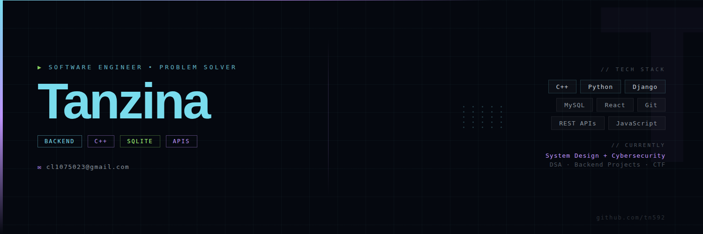

# Hey, I'm Tanzina 👋

```bash
> booting developer profile...
> backend systems   [OK]
> debugging bugs    [OK]
> learning mode     [ALWAYS ON]
```

<div align="center">

### Software Engineer • Backend Developer • Problem Solver

<p>
  <a href="https://leetcode.com/u/tn231104/">
    
  </a>
  <a href="https://codeforces.com/profile/tn012">
    
  </a>
</p>

</div>

---

## 🌌 About Me

```cpp
class Tanzina {
public:
    string role = "Computer Science Student";
    string focus = "Backend Engineering & APIs";
    string currentlyLearning = "System Design + Cybersecurity";
    string favoriteLanguage = "C++";
    bool lovesLinux = true;

    void lifeGoal() {
        cout << "Build cool software & grow into a great engineer";
    }
};
```

* 🎓 Studying **Computer Science & Engineering**
* 💻 Passionate about building backend systems and full-stack applications
* ⚡ Interested in **Cybersecurity**, **REST APIs**, and scalable systems
* 🐧 Linux + terminal enjoyer
* 🌙 Most productive during late-night coding sessions
* 📚 Always learning something new

---

## 🛠️ Tech Stack

<p align="center">
  <a href="https://skillicons.dev">
    
  </a>
</p>

---

## 📈 Current Focus

```txt
[✓] Building backend projects
[✓] Improving DSA & problem solving
[✓] Exploring Linux & terminal workflows
[✓] Learning cybersecurity concepts
[ ] Sleeping properly
```

---

## 📊 GitHub Stats

<div align="center">


</div>

---

## 🎯 Fun Facts

* 🌃 Night coding sessions are elite
* 🐾 My cat sometimes supervises my coding sessions like a strict project manager
* 🏰 I love castles and mysterious ancient architecture

---

<div align="center">

### "Code. Learn. Build. Repeat."

</div>
